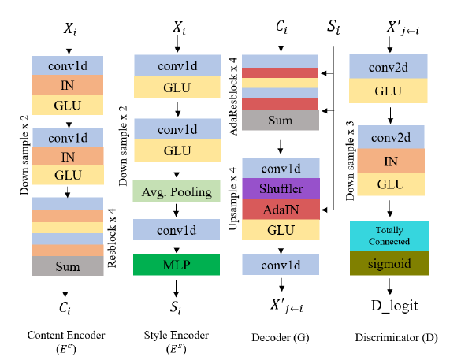

# 🎙️ Non-Parallel Emotional Voice Conversion using CycleGAN

This repository contains the official implementation of the paper **"[Non-Parallel Training Approach for Emotional Voice Conversion Using CycleGAN"](https://www.researchgate.net/publication/375807478_Non-Parallel_Training_Approach_for_Emotional_Voice_Conversion_Using_CycleGAN)**.

This project implements a CycleGAN-based voice conversion pipeline that converts emotional speech between two domains (A ↔ B) using non-parallel training data. It relies on **WORLD** for speech analysis/synthesis and **TensorFlow** for the CycleGAN model.

# 🔀 Model Concept: Content–Style Disentanglement


This figure illustrates the core idea of the proposed method: **disentangling content and style** from an input signal and recombining them to generate emotion-transferred outputs.

Given two input sequences $X_1$ and $X_2$, each is processed by:


- **Style Encoder $E^s$** → extracts style features $s_1, s_2$  
- **Content Encoder $E^c$** → extracts content features $c_1, c_2$  

The Decoder $G$ then recombines content and style in different pairings:

- $c_1 + s_1$ → reconstruction of $X_1$ in Emotion 1  
- $c_1 + s_2$ → $X_{1 \rightarrow 2}'$: content of $X_1$ expressed in Emotion 2  
- $c_2 + s_2$ → reconstruction of $X_2$ in Emotion 2  
- $c_2 + s_1$ → $X_{2 \rightarrow 1}'$: content of $X_2$ expressed in Emotion 1  

This cross-combination mechanism enables **emotion transfer** while preserving the original linguistic or structural content.


# 🧩 Network Architecture



This figure **(from our published paper)** illustrates the overall architecture used in our system. The model is composed of four main components:

## 1. Content Encoder (Ec)
Extracts content-related features using:
- Conv1D + IN + GLU blocks  
- Downsampling  
- Residual blocks  
- Skip-connection summation  
**Output:** Content embedding $(C_i)$

## 2. Style Encoder (Es)
Captures global style information through:
- Conv1D + IN + GLU  
- Downsampling  
- Average pooling  
- MLP projection  
**Output:** Style embedding $(S_i)$

## 3. Decoder (G)
Reconstructs the output sequence by combining $(C_i)$ with target style $(S_j)$:
- AdaResBlocks with AdaIN  
- Upsampling + Shuffler  
- GLU activations  
- Final Conv1D  
**Output:** Stylized sequence $(X'_{j \leftarrow i})$

## 4. Discriminator (D)
Used for adversarial training:
- Conv2D + IN + GLU  
- Downsampling  
- Fully connected layer + Sigmoid  
**Output:** Discriminator score $(D_{\text{logit}})$


## 🚀 Quick Start
1. Prepare two directories of wav files for `source (A)` and `target (B)` emotions.
2. Train the model:

```cmd
python train.py
```

---

## 📦 Repository Structure (important files)
- `train.py` — CLI entry point to train a CycleGAN model.
- `train_function.py` — Preprocessing and training loop (hyperparameters live here).
- `conversion.py` — CLI entry point to convert audio with a trained model.
- `conversion_function.py` — Conversion pipeline that loads model & normalization and synthesizes audio using WORLD.
- `model.py` — TF1.x wrapper implementing the CycleGAN graph and train/test/save/load APIs.
- `module.py` — Generator and discriminator architectures (gated CNN / GLU blocks).
- `utils.py` — Helpers: loading, normalization, padding, sampling, loss functions.
- `WORLD_utils.py` — Thin wrappers around `pyworld` (decompose, encode/decode, synthesize).


## 🧠 Implementation notes & gotchas (must-read)

- TensorFlow 1.x: code uses `tf.Session`, `tf.contrib`, and TF1 graph semantics. Do NOT convert to TF2 eager mode without adding compatibility shims.
- Data shapes: model expects inputs shaped `[batch, num_features, num_frames]`. `module.generator_gatedcnn` transposes inputs to `[batch, time, features]` internally — keep this ordering when feeding `model.test()` and `model.train()`.
- Normalization artifacts: training saves `mcep_normalization.npz` and `logf0s_normalization.npz` under the chosen `model_dir`. Conversion reads these files and expects keys `mean_A`, `std_A`, `mean_B`, `std_B`.
- Silence handling: `utils.sample_train_data()` removes segments where the F0 slice is all zeros. Datasets must include voiced segments to produce samples.
- Default audio params (used across code): `sampling_rate = 44100`, `num_mcep = 24`, `frame_period = 5.0`, `n_frames = 128`.
- Mini-batch: default `mini_batch_size = 1` (author notes this works better). Changing batch size may require attention to padding and time alignment.
- Librosa deprecation: the code uses `librosa.output.write_wav`. On modern `librosa` replace with `soundfile.write` or pin an older `librosa`.

---

## 🧩 Training & Conversion — Examples and flags

- Train with defaults (Windows `cmd`):

```cmd
python train.py
```

- Train with custom paths and seed:

```cmd
python train.py --train_A_dir ".\\Database\\Emotion\\ang_neu\\ang" --train_B_dir ".\\Database\\Emotion\\ang_neu\\neu" --model_dir ".\\model\\ang2neu" --model_name ang2neu.ckpt --random_seed 0
```

- Convert using a pre-trained checkpoint:

```cmd
python conversion.py --model_dir ".\\model\\ang2neu" --model_name ang2neu.ckpt --data_dir ".\\Database\\Emotion\\ang_neu\\val_ang" --conversion_direction A2B --output_dir ".\\converted_voices"
```

Notes:
- `model.save(directory, filename)` writes a checkpoint prefix equal to `os.path.join(directory, filename)`. `model.load(filepath)` expects that same prefix.
- Validation conversions are produced periodically during training when `validation_A_dir` / `validation_B_dir` are provided.


## 📝 Citation

If you find this repository useful, include us in your citation:

```bibtex
@conference{icinco23,
author={Mohamed Elsayed and Sama Hadhoud and Alaa Elsetohy and Menna Osman and Walid Gomaa},
title={Non-Parallel Training Approach for Emotional Voice Conversion Using CycleGAN},
booktitle={Proceedings of the 20th International Conference on Informatics in Control, Automation and Robotics - Volume 2: ICINCO},
year={2023},
pages={17-24},
publisher={SciTePress},
organization={INSTICC},
doi={10.5220/0012156000003543},
isbn={978-989-758-670-5},
issn={2184-2809},
}
```

## 🙌 Acknowledgements

Special thanks to **[hishammadcor](https://github.com/hishammadcor)** for valuable discussions, guidance, and giving us access to the dataset used in this work.  
